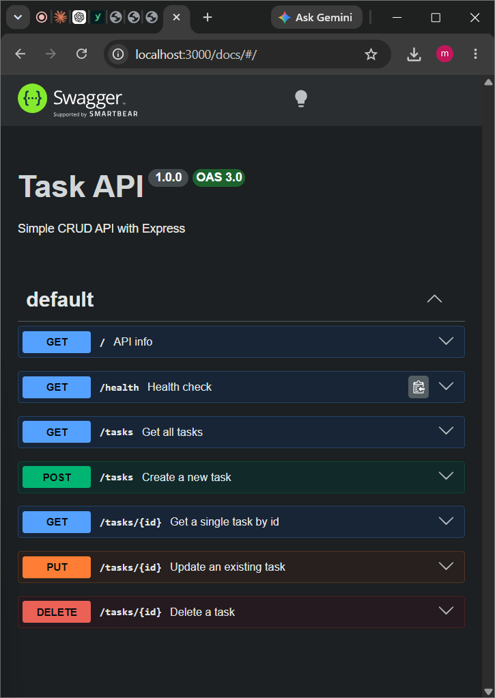
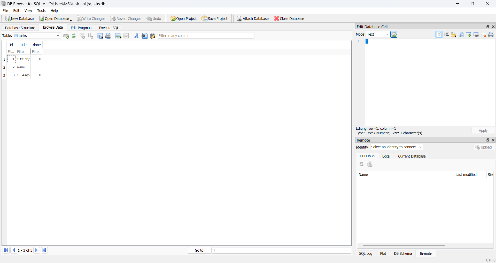

# Task API

A small CRUD API for managing a to-do list, built with **Node.js** and **Express**. Data is stored in a **SQLite database** (`tasks.db`) — it survives server restarts.

Built as part of the FlyRank Internship — Backend Track, Week 2 & Week 3, Assignments A1 and A2.

## Features

- Full CRUD on tasks: Create, Read, Update, Delete
- Data persisted in SQLite — survives restarts
- Input validation with proper HTTP status codes
- Interactive API docs with Swagger UI
- All database queries use parameterized placeholders (no SQL injection)

## Why SQLite

- **Single file.** The whole database is one file, `tasks.db` — no separate server to install or run.
- **Zero setup.** No accounts, no config, no external service. It just works the moment the app starts.
- **Survives restarts.** Unlike the in-memory version from Week 2, tasks are written to disk, so they're still there after the server stops and starts again.

## How to run

1. Clone this repo:
   ```bash
   git clone https://github.com/MOHAMED-556322/task-api-js.git
   cd task-api-js
   ```
2. Install dependencies:
   ```bash
   npm install
   ```
3. Start the server:
   ```bash
   node index.js
   ```
4. The API is now running at `http://localhost:3000`

On first run, the server automatically creates `tasks.db`, creates the `tasks` table, and seeds 3 example tasks (Study, Gym, Sleep). This only happens once — restarting the server does not duplicate the seed data.

**Note:** `tasks.db` is git-ignored, so every fresh clone starts with a clean database that seeds itself automatically.

## Endpoints

| Method | Path          | Description                    | Success | Errors        |
|--------|---------------|---------------------------------|---------|---------------|
| GET    | `/`           | API info                        | 200     | —             |
| GET    | `/health`     | Health check                    | 200     | —             |
| GET    | `/tasks`      | Get all tasks                   | 200     | —             |
| GET    | `/tasks/:id`  | Get a single task by id         | 200     | 404           |
| POST   | `/tasks`      | Create a new task               | 201     | 400           |
| PUT    | `/tasks/:id`  | Update an existing task         | 200     | 400, 404      |
| DELETE | `/tasks/:id`  | Delete a task                   | 204     | 404           |

## Example request

```bash
curl -i http://localhost:3000/tasks/1
```

```
HTTP/1.1 200 OK
Content-Type: application/json; charset=utf-8

{"id":1,"title":"Study","done":false}
```

## Swagger UI

Interactive API docs (with a "Try it out" button for every endpoint) are available at:

```
http://localhost:3000/docs
```



## Exploring the database directly

The database can be opened and queried by hand in [DB Browser for SQLite](https://sqlitebrowser.org/). The API and DB Browser read the exact same file — there's no syncing step, just one source of truth.



Example query run in DB Browser's "Execute SQL" tab:

```sql
SELECT COUNT(*) FROM tasks;
```

This returned `3` — matching the 3 seeded tasks. Running `UPDATE` or `DELETE` queries here and then calling `GET /tasks` from the API instantly reflects the change, with no server restart needed.

## Notes

- Data now lives in `tasks.db` and survives server restarts — this is the key difference from the Week 2 in-memory version.
- The `tasks` table and its 3 seed tasks are created automatically on first run; the seed only runs when the table is empty.
- All CRUD operations use parameterized SQL queries (`?` placeholders) to prevent SQL injection.
# Task API

A small CRUD API for managing a to-do list, built with **Node.js** and **Express**. Data is stored in a **SQLite database** (`tasks.db`) — it survives server restarts.

Built as part of the FlyRank Internship — Backend Track, Week 2 & Week 3, Assignments A1 and A2.

## Features

- Full CRUD on tasks: Create, Read, Update, Delete
- Data persisted in SQLite — survives restarts
- Input validation with proper HTTP status codes
- Interactive API docs with Swagger UI
- All database queries use parameterized placeholders (no SQL injection)

## Why SQLite

- **Single file.** The whole database is one file, `tasks.db` — no separate server to install or run.
- **Zero setup.** No accounts, no config, no external service. It just works the moment the app starts.
- **Survives restarts.** Unlike the in-memory version from Week 2, tasks are written to disk, so they're still there after the server stops and starts again.

## How to run

1. Clone this repo:
   ```bash
   git clone https://github.com/MOHAMED-556322/task-api-js.git
   cd task-api-js
   ```
2. Install dependencies:
   ```bash
   npm install
   ```
3. Start the server:
   ```bash
   node index.js
   ```
4. The API is now running at `http://localhost:3000`

On first run, the server automatically creates `tasks.db`, creates the `tasks` table, and seeds 3 example tasks (Study, Gym, Sleep). This only happens once — restarting the server does not duplicate the seed data.

**Note:** `tasks.db` is git-ignored, so every fresh clone starts with a clean database that seeds itself automatically.

## Endpoints

| Method | Path          | Description                    | Success | Errors        |
|--------|---------------|---------------------------------|---------|---------------|
| GET    | `/`           | API info                        | 200     | —             |
| GET    | `/health`     | Health check                    | 200     | —             |
| GET    | `/tasks`      | Get all tasks                   | 200     | —             |
| GET    | `/tasks/:id`  | Get a single task by id         | 200     | 404           |
| POST   | `/tasks`      | Create a new task               | 201     | 400           |
| PUT    | `/tasks/:id`  | Update an existing task         | 200     | 400, 404      |
| DELETE | `/tasks/:id`  | Delete a task                   | 204     | 404           |

## Example request

```bash
curl -i http://localhost:3000/tasks/1
```

```
HTTP/1.1 200 OK
Content-Type: application/json; charset=utf-8

{"id":1,"title":"Study","done":false}
```

## Swagger UI

Interactive API docs (with a "Try it out" button for every endpoint) are available at:

```
http://localhost:3000/docs
```


## Exploring the database directly

The database can be opened and queried by hand in [DB Browser for SQLite](https://sqlitebrowser.org/). The API and DB Browser read the exact same file — there's no syncing step, just one source of truth.


Example query run in DB Browser's "Execute SQL" tab:

```sql
SELECT COUNT(*) FROM tasks;
```

This returned `3` — matching the 3 seeded tasks. Running `UPDATE` or `DELETE` queries here and then calling `GET /tasks` from the API instantly reflects the change, with no server restart needed.

## Notes

- Data now lives in `tasks.db` and survives server restarts — this is the key difference from the Week 2 in-memory version.
- The `tasks` table and its 3 seed tasks are created automatically on first run; the seed only runs when the table is empty.
- All CRUD operations use parameterized SQL queries (`?` placeholders) to prevent SQL injection.
